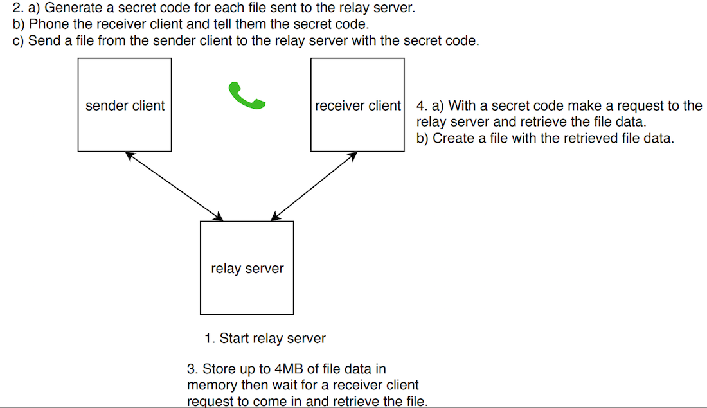

# File Sending Homework Problem

## Description

This README describes the solution implemented for the Storj homework problem found here  https://gist.github.com/jtolds/0cde4aa3e07b20d6a42686ad3bc9cb53.

## Prerequisites

* Golang >= v1.11 [installed](https://golang.org/dl/).

## Run

* Build and run the relay server. From the `assuringwren/relay` dir, 

`go build`

`./relay :<port>`

* Send a file to the relay server using the sender program. In another tab of a terminal, from the `assuringwren/send` dir,

`go build`

`./send <relay-host>:<relay-port> <file-to-send>`

* Receive a file from the relay server using the receiver program. In another tab of a terminal, from the `assuringwren/receive` dir,

`go build`

`./receive <relay-host>:<relay-port> <secret-code> <output-directory>`

## Tests

Run tests with code coverage and verbose output. From inside the `assuringwren` directory, run:

`go test -v ./... -cover`

## Architecture

Below is a diagram of the overall architecture with high level interactions of the three programs. Under the diagram there are technical details listed of what is occurring in the code at each step.

Here are more technical details about what is occurring at each step:

1. When the relay server starts up:
    - 1.1 a tcp server is created and listens for incoming connections on the port that was provided.
    - 1.2 a data storage object is created that will store all files and file metadata (i.e. size and name) that come from the sender client.

2. When the sender client wants to send a file to the receiver, it will:
    - 2.1 generate a secret code that is a random integer and print it to stdout.
    - 2.2 call the receiver client on the phone and tell them what the secret code it.
    - 2.3 initiate a request to the relay server:
        - 2.3.1 first send the file metadata and secret
        - 2.3.2 then send the file data 
        - 2.3.3 if the relay server 4MB buffer is full, then block and wait for there to be space available to write more file data.

3. When the relay server gets a request from a sender client, it will:
    - 3.1 read the header which will include the file metadata and the secret code (from step 2.3.1).
    - 3.2 create a file store object that stores the file metadata and a buffered channel that will contain the file bytes.
    - 3.3 add the file store object to the data store object created in step 1.2 so that the receiver client is able to access that same information.
    - 3.4 read the file bytes that are coming in and sends them to the file store object buffered channel. The bytes will stay in the channel until a receiver client reads them. 

4. When the receiver client has a secret code and wants to request the associated file from the relay server, it will send a request to the relay server for the file:
    - 4.1 First the receiver sends a header containing the secret code to the relay server.
    - 4.2 The relay server confirms there is a file store for the file associated with that secret code.
    - 4.3 The relay server then sends back to the receiver the file metadata so that the receiver knows the name and size of the file.
    - 4.4 The relay server reads all bytes from the buffered channel from step 3.4 until the channel is closed signaling that the full file has been sent.
    - 4.5 The receiver creates a file with the name provided from step 4.4 and the output path provided as an argument to the receiver program.

## If I had more time

I think it's interesting to consider what additional changes would be made if there was more time. Here is my list:

- Start with creating a formal design document.

- Add authentication.

- Securely send the secret code and file data over the wire.

- Add a timeout if the receiver client never shows up to get the file.

- Reorganize the file structure of the programs so that all of the code is not in main.go, but rather in appropriate other files or packages.

- Refactor the code so that it is easier to unit test. This would involve breaking out large functions into smaller functions with clear inputs/outputs so it is easier to test what data transformations are occurring per function.

- Increase unit test code coverage up to a minimum of 85% and add benchmark, integration, and load/performance tests.

- Add automated CI/CD to run all tests, deploy to staging, execute load/performance/e2e tests against staging, and deploy to production all staging tests pass.

## Author

Assuring Wren
